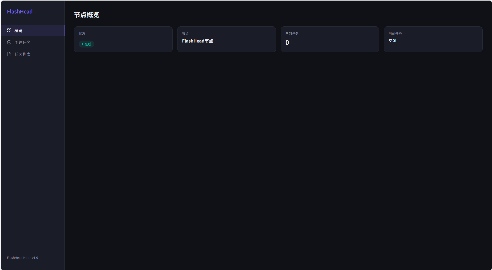
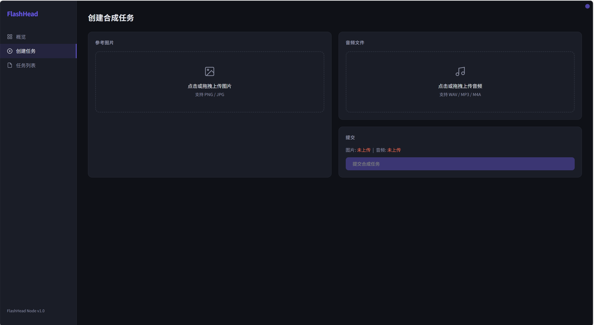
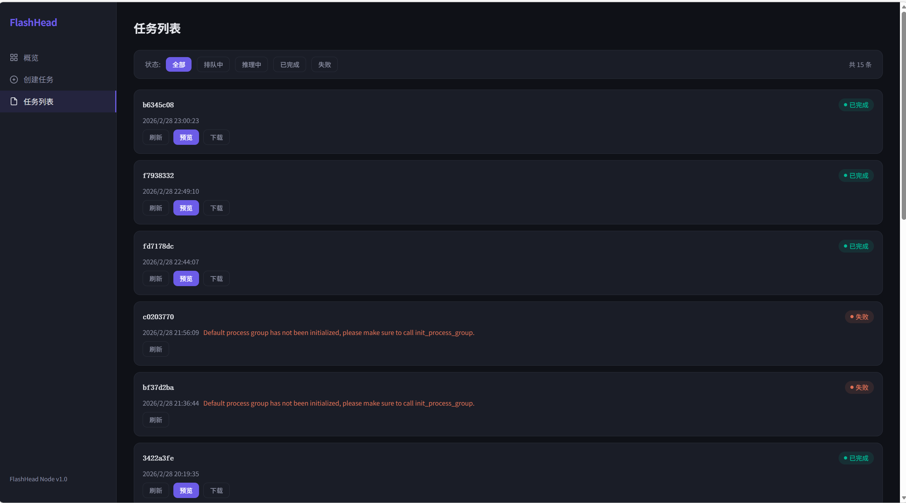
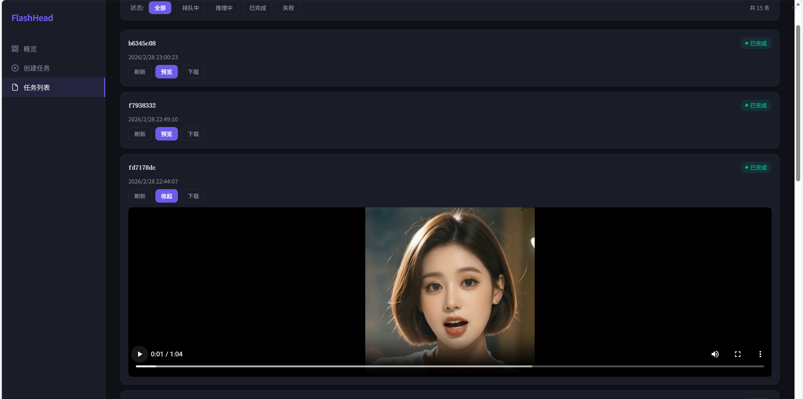

# Once FlashHead API

基于 [SoulX-FlashHead](https://github.com/Soul-AILab/SoulX-FlashHead) 的说话头部视频生成服务。上传一张人像图片和一段音频，自动裁剪头肩区域并生成 512×512 的说话头部视频。

服务层对齐 [Once Edge](https://github.com/Starter-Kit-Org) 算法服务标准架构，提供完整的 RESTful API、异步任务队列和可视化管理面板。

---

## 系统截图

### 节点概览

节点运行状态一览：在线状态、队列深度、当前任务。



### 创建合成任务

上传参考图片和音频文件，一键提交合成任务。



### 任务列表

按状态筛选任务，查看历史记录，支持刷新、预览和下载。



### 视频预览

任务完成后在线预览生成的说话头部视频。



---

## 功能特性

- **双模式推理** — lite（单卡蒸馏模型）/ pro（预训练模型，支持单卡或双卡序列并行）
- **自动人脸裁剪** — 基于 MediaPipe 的 CPU 人脸检测，自动定位并裁剪头肩正方形区域；也支持前端手动指定裁剪区域
- **异步任务队列** — Redis 队列 + 单线程池串行调度，提交即返回 task_id，轮询获取进度
- **管理面板** — 内置 Vue 3 单页面，暗色主题，可视化管理任务与文件
- **网关对接** — 支持向 Once Edge 网关自动注册节点 + 心跳保活
- **API Key 认证** — 所有业务接口通过 `X-API-Key` Header 鉴权
- **自动清理** — 过期上传文件定时清理，可配置保留时长

---

## 项目结构

```
once_flash_head_api/
├── config/                         # 配置层
│   ├── config.yml                  #   唯一配置文件（.gitignore 已忽略）
│   ├── schema.py                   #   Pydantic 配置模型 (AppConfig)
│   └── loader.py                   #   get_config() 单例加载器
├── state/                          # 状态层（数据库 / 队列 / 调度）
│   ├── db_engine.py                #   SQLAlchemy 引擎 (PostgreSQL, 自动建表)
│   ├── db_models.py                #   ORM 模型: Task, UploadedFile
│   ├── db_operations.py            #   数据库 CRUD
│   ├── redis_client.py             #   Redis 客户端（任务队列 + 进度）
│   └── scheduler.py                #   单线程池任务调度器
├── schema/                         # 数据模型
│   ├── enums.py                    #   TaskStatus 枚举
│   └── request_entities.py         #   请求体定义 (SynthesizeRequest 等)
├── service/                        # 服务层
│   ├── app.py                      #   FastAPI 应用 + 生命周期管理
│   ├── dependencies.py             #   API Key 认证依赖
│   └── routes/                     #   路由
│       ├── task_api.py             #     任务：合成 / 查询 / 下载
│       ├── file_api.py             #     文件：上传
│       └── system_api.py           #     系统：健康检查、调度器状态
├── cores/                          # 核心适配
│   └── pipeline_adapter.py         #   FlashHead 推理适配器（初始化 / 预处理 / 推理 / 编码）
├── utils/                          # 工具
│   ├── result.py                   #   统一响应格式 R
│   └── file_manager.py             #   文件上传管理
├── flash_head/                     # 核心算法（SoulX-FlashHead 源码，不修改）
│   ├── inference.py                #   推理入口
│   ├── audio_analysis/             #   wav2vec2 音频特征提取
│   ├── ltx_video/                  #   LTX-Video VAE & Transformer
│   ├── wan/                        #   WAN VAE 模块
│   ├── src/                        #   FlashHead 模型 + 分布式推理
│   ├── utils/                      #   人脸裁剪、工具函数
│   └── configs/                    #   推理参数 (infer_params.yaml)
├── checkpoint/                     # 模型权重（需自行下载，已 gitignore）
│   ├── SoulX-FlashHead-1_3B/      #   FlashHead 1.3B 模型
│   └── wav2vec2-base-960h/         #   wav2vec2 音频编码器
├── libs/                           # 外部工具（已 gitignore，需自行下载）
│   └── ffmpeg(.exe)                #   FFmpeg 可执行文件
├── images/                         # README 截图
├── templates/
│   └── index.html                  # Vue 3 管理面板（暗色主题单页应用）
├── base.py                         # 路径常量
├── start_api.py                    # 启动入口
├── requirements.txt                # Python 依赖
└── cache/                          # 运行时缓存（自动创建，已 gitignore）
    ├── uploads/                    #   上传文件暂存
    └── out/                        #   输出视频
```

---

## 环境要求

| 依赖 | 版本 |
|------|------|
| Python | 3.10 |
| CUDA | 12.8+ |
| PyTorch | 2.7.1 |
| PostgreSQL | 12+ |
| Redis | 5+ |
| FFmpeg | 4.4+ |

> GPU 显存需求：lite 模式约 8 GB，pro 模式约 18 GB（单卡 4090 24GB 可运行）。

### FFmpeg

项目依赖 FFmpeg 进行视频编码，需要自行下载并放置到 `libs/` 目录下，然后在 `config.yml` 中配置 `ffmpeg_path` 为绝对路径。

- **Windows**：下载 [ffmpeg-release-essentials.zip](https://www.gyan.dev/ffmpeg/builds/)，解压后将 `ffmpeg.exe` 放入 `libs/`
- **Linux**：下载 [ffmpeg-release-amd64-static.tar.xz](https://johnvansickle.com/ffmpeg/)，解压后将 `ffmpeg` 二进制放入 `libs/`

---

## 快速开始

### 1. 创建环境

```bash
conda create -n flashhead python=3.10
conda activate flashhead
```

### 2. 安装依赖

```bash
# PyTorch (CUDA 12.8)
pip install torch==2.7.1 torchvision==0.22.1 --index-url https://download.pytorch.org/whl/cu128

# 项目依赖
pip install -r requirements.txt

# FlashAttention（需要 ninja 编译）
pip install ninja && pip install flash_attn==2.8.0.post2 --no-build-isolation
```

### 3. 准备模型权重

将模型文件放置到 `checkpoint/` 目录下：

```
checkpoint/
├── SoulX-FlashHead-1_3B/    # FlashHead 模型权重
└── wav2vec2-base-960h/       # wav2vec2 音频编码器
```

### 4. 修改配置

复制并编辑 `config/config.yml`，按实际环境修改以下字段：

```yaml
database:
  host: "your-pg-host"
  password: "your-pg-password"

redis:
  host: "your-redis-host"
  password: "your-redis-password"

flashhead:
  mode: lite                  # lite 或 pro
  ckpt_dir: "/absolute/path/to/checkpoint/SoulX-FlashHead-1_3B"
  wav2vec_dir: "/absolute/path/to/checkpoint/wav2vec2-base-960h"

server:
  port: 8100
  api_key: "your-api-key"

ffmpeg_path: "/absolute/path/to/ffmpeg"
cache_dir: "/absolute/path/to/cache"
out_dir: "/absolute/path/to/cache/out"
```

> **注意**：所有路径必须使用绝对路径。`config.yml` 已被 `.gitignore` 忽略，不会提交到仓库。

### 5. 启动服务

```bash
python start_api.py
```

服务启动后访问：

| 地址 | 说明 |
|------|------|
| `http://localhost:8100/` | 管理面板 |
| `http://localhost:8100/docs` | Swagger API 文档 |
| `http://localhost:8100/redoc` | ReDoc API 文档 |

---

## API 接口

所有业务接口需携带 Header：`X-API-Key: <your-api-key>`

### 上传文件

```http
POST /api/files/upload
Content-Type: multipart/form-data

支持格式：.png .jpg .jpeg .wav .mp3 .m4a
```

**响应示例：**

```json
{
  "code": 200,
  "message": "success",
  "data": {
    "file_id": "uuid",
    "filename": "photo.png",
    "file_size": 102400,
    "file_type": "image"
  }
}
```

### 提交合成任务

```http
POST /api/tasks/synthesize
Content-Type: application/json

{
  "image_file_id": "上传返回的 file_id",
  "audio_file_id": "上传返回的 file_id",
  "crop_region": [x, y, w, h]
}
```

- `crop_region` 为可选字段，不传则自动进行人脸检测裁剪

### 查询任务状态

```http
GET /api/tasks/{task_id}
```

任务状态流转：`pending` → `running` → `completed` / `failed`

### 下载结果视频

```http
GET /api/tasks/{task_id}/download
```

返回 MP4 视频文件流。

---

## 推理模式

| 模式 | 模型 | 推理步数 | GPU 需求 | 说明 |
|------|------|---------|---------|------|
| **lite** | 蒸馏模型 (1.3B) | 4 steps | 单卡 (~8GB) | 速度快，适合实时场景 |
| **pro** | 预训练模型 (1.3B) | 4 steps | 单卡 (~18GB) 或 双卡 | 质量更高，单卡 4090 24GB 可运行；双卡自动 torchrun 序列并行 |

> Teacher 模型尚未发布，当前 pro 模式使用已发布的预训练模型。

在 `config.yml` 中设置 `flashhead.mode` 切换模式。pro 双卡模式通过 `flashhead.pro_device_ids` 指定 GPU。

---

## 业务流程

```
用户上传图片/音频
       │
       ▼
POST /api/files/upload ──→ 返回 file_id
       │
       ▼
POST /api/tasks/synthesize
       │
       ├─ 有 crop_region ──→ 按指定区域裁剪
       │
       └─ 无 crop_region ──→ MediaPipe 人脸检测
                                  │
                                  ▼
                          ratio=2.0 裁剪正方形
                                  │
                                  ▼
                      resize_and_centercrop → 512×512
                                  │
                                  ▼
                      FlashHead Pipeline 推理
                                  │
                                  ▼
                        FFmpeg 编码 → .mp4
                                  │
                                  ▼
              GET /api/tasks/{task_id} ──→ 查询状态
              GET /api/tasks/{task_id}/download ──→ 下载视频
```

---

## 鸣谢

- [SoulX-FlashHead](https://github.com/Soul-AILab/SoulX-FlashHead) — 核心说话头部生成算法

---

## 许可证

本项目基于 [Apache License 2.0](LICENSE) 开源。
